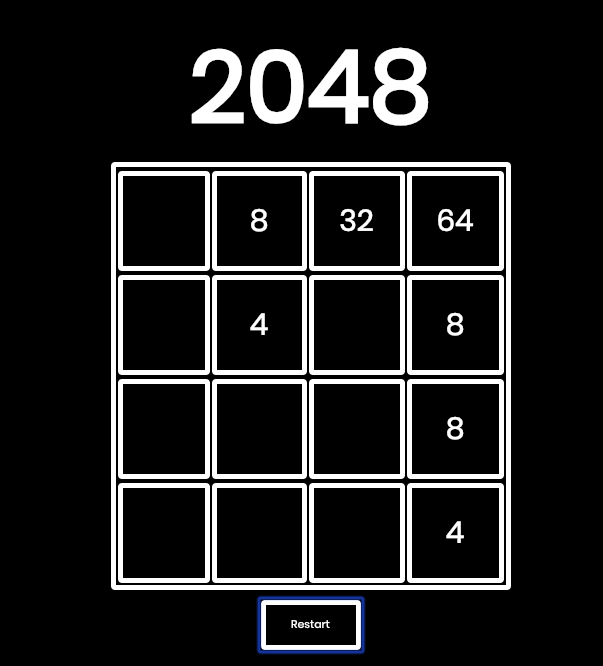

# 2048

 **2048 Game**

 **GAME PLAY**

 Use the ARROW KEYS to move the tiles. When tiles with the same value touch, they merge, displaying the sum of the values. Goal is to merge tiles until one tile shows the value of 2048

 
 

 
 Generates a 2 or 4 and places it in a random cell by generating a random number to use as the cellID.

 
 Keydown event being used on all the arrow keys to call the related functions.

 
 When the up arrow is pressed (see event handlers above) these functions are called to loop through all of the cells to check for empty spaces and check for matches.

 **TECHNOLOGIES USED**
 HTML
 CSS
 Javascript

 **NEXT UP**
 - Make sure the tiles only merge onces (ie. if row is 4, 4, 4, 4, it becomes 8, 8 and not 16)
